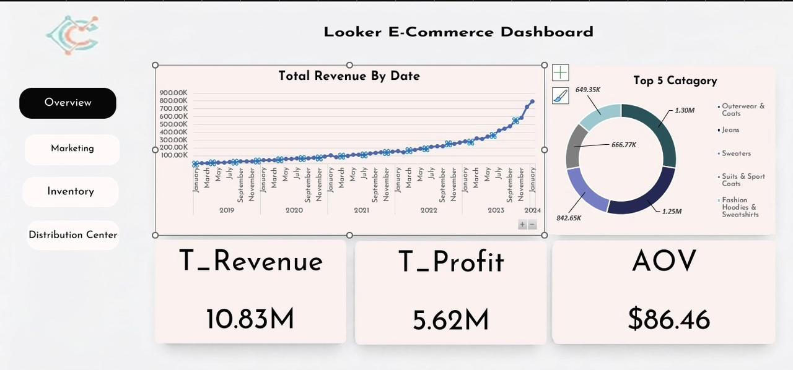
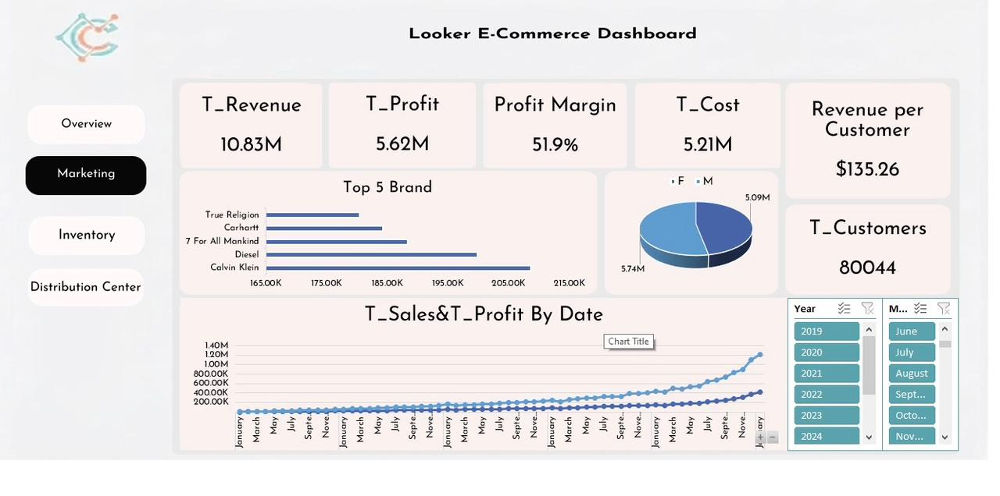
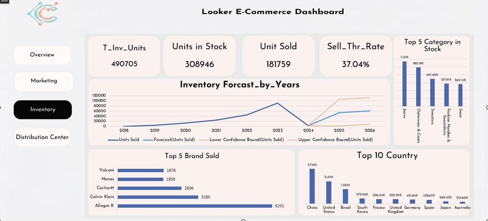
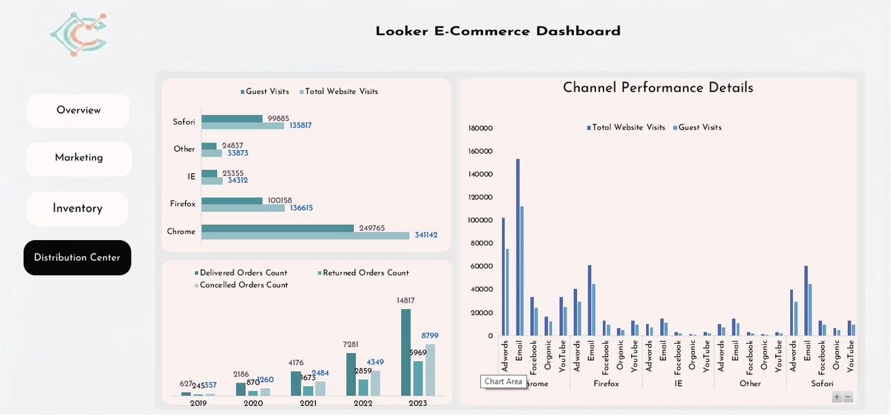

# Looker E-Commerce Performance Dashboard | Microsoft Excel

### Overview

## Project Overview

This project presents an interactive E-Commerce Business Intelligence Dashboard built in Microsoft Excel with a modern user interface designed in Figma.

The dashboard transforms raw business data into actionable insights through four connected pages covering sales, marketing, inventory, and distribution performance.

## Full Excel Dashboard ( Download ):
https://drive.google.com/file/d/1HKhs0riW-v90wXWMmAvvcvINc3_j4kOV/view?usp=drive_link

## Dataset

The dataset used in this project is publicly available on Kaggle.

**Source:** https://www.kaggle.com/datasets/mustafakeser4/looker-ecommerce-bigquery-dataset

> **Note:** The original project was built using a dataset containing more than 3 million records. To keep this repository lightweight, only the dashboard screenshots and project documentation are included.

---

## Dashboard Pages

### Overview

- Revenue Trend

- Total Revenue

- Total Profit

- Average Order Value (AOV)

- Top Product Categories

### Marketing

- Revenue & Profit Analysis

- Profit Margin

- Revenue per Customer

- Brand Performance

- Customer Analysis

### Inventory

- Inventory Units

- Units Sold vs Units in Stock

- Sell-Through Rate

- Inventory Forecast

- Top Selling Brands

### Distribution Center

- Website Traffic Analysis

- Browser Performance

- Marketing Channel Performance

- Delivered, Returned, and Cancelled Orders

---

## Project Highlights

- Cleaned and prepared the dataset for analysis.

- Designed the dashboard interface in **Figma** before implementation.

- Built a fully interactive multi-page dashboard in **Microsoft Excel**.

- Created KPI cards, Pivot Tables, Pivot Charts, and Slicers.

- Developed interactive navigation between dashboard pages.

- Performed sales, marketing, inventory, and distribution analysis.

- Applied inventory forecasting to support business planning.

---

## Business Insights & Recommendations

- Revenue demonstrates a consistent growth trend over time.

- High-performing product categories contribute the majority of total revenue.

- Marketing channel performance highlights opportunities for budget optimization.

- Inventory forecasting supports better stock planning and reduces overstock or stockouts.

- Monitoring delivery, return, and cancellation rates helps improve operational efficiency and customer satisfaction.

---

## Tools & Skills

- Microsoft Excel

- Figma

- Pivot Tables

- Pivot Charts

- Slicers

- Timeline Filters

- Advanced Excel Formulas

- KPI Reporting

- Forecast Analysis

- Dashboard Design

- Data Visualization

---

## Dashboard Preview

### Overview

### Marketing

### Inventory

### Distribution Center

---

## Author

**Mohamed Nashaat**

If you found this project interesting, feel free to connect with me on LinkedIn and check out my other projects.
## linkedin Profile:
https://www.linkedin.com/in/mohamed-nashaat-47b685321?utm_source=share_via&utm_content=profile&utm_medium=member_ios
